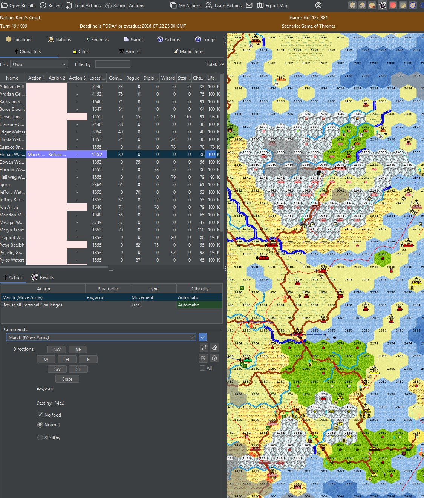

<div align="center">

# Clash of Legends - Counselor

**The free, open-source desktop client for [Clash of Legends](https://clashlegends.com), a computer-moderated turn-based strategy game of empires, armies, intrigue, and (now) dragons.**

[](LICENSE)
[](../../releases/latest)
[](../../releases)


[](../../stargazers)

[Play](https://clashlegends.com) &nbsp;·&nbsp; [Download](../../releases/latest) &nbsp;·&nbsp; [What's new](CHANGELOG.md) &nbsp;·&nbsp; [Privacy](PRIVACY.md)

</div>

---

<div align="center">

[](docs/screenshot.jpg)

<sub>The Counselor: character roster, the point-and-click order builder, and the live map with cities, armies, and a planned march path.</sub>

</div>

---

## What is this?

*Clash of Legends* is a play-by-mail strategy game with deep wargame and economic systems and a light role-playing layer. It has been running and evolving for over 20 years. Each turn you receive a result file, plan your moves, and submit your orders; the game server processes everyone's orders together and sends back the next turn. One turn per week is typical, so it rewards thinking over twitch.

**Counselor** is the client you actually play in. It opens your turn file (`.egf`), draws the whole world, and turns order-writing into point-and-click:

- 🗺️ **Full interactive map** - fog of war, terrain, cities, armies, and scout reports, with zoom, a symbol legend, and click-to-target for almost any order.
- ⚔️ **Point-and-click orders** - build every action from filterable pickers instead of memorizing codes; aim movement, spells, and city targets straight on the map.
- 📊 **Victory Dashboard and graphs** - see, in plain language, how the game is won and how close each side is, plus power-comparison, "what should I grow?", and momentum charts.
- 🐉 **Fire & Dragons** - full support for the Game-of-Thrones-flavored variant (dragons, dragonriders, and its unique victory conditions).
- 🤝 **Team play** - review your whole team's plan, and view (read-only) an ally's orders on the map before the deadline.
- 🎨 **Modern UI** - light and dark themes, high-DPI map, character portraits, and 5 languages (English, Portuguese, Spanish, Italian, Catalan).
- 🔄 **Self-updating** and **cross-platform** - Windows, macOS, and Linux, each with a bundled Java runtime so there is nothing else to install.

New players are welcome. If you have never tried a game like this, the [main site](https://clashlegends.com) explains the world and how to join.

---

## Download and play

Grab the latest build for your platform from the [**Releases**](../../releases/latest) page:

| Platform | File | Notes |
|---|---|---|
| Windows | `Counselor-x.y.z.msi` | Standard installer (needs admin rights) |
| Windows | `Counselor-windows-portable.zip` | No install, no admin: extract and run |
| Windows | `Counselor-portable.zip` | JAR + launchers, needs Java 21 on PATH |
| macOS | `Counselor-x.y.z.dmg` | Standard installer |
| Linux | `counselor_x.y.z_amd64.deb` | Standard package |

The `.msi`, `.dmg`, `.deb`, and the Windows portable ZIP all bundle a Java 21 runtime, so no separate JDK is needed. Only the small `Counselor-portable.zip` (JAR only) requires Java 21 already installed.

**Corporate or restricted laptops:** use `Counselor-windows-portable.zip` (no admin needed). If antivirus wrongly flags the unsigned `Counselor.exe`, run `run-portable.bat` instead - it boots via the bundled, code-signed Java runtime.

### Getting into a game

1. Sign up and request a game at [clashlegends.com](https://clashlegends.com).
2. On first run, open **Settings** and paste your **Counselor token** (fetch it from the website with one click, or copy it from your account page).
3. Open your turn file (`.egf`), plan, and hit submit. Counselor uploads your orders straight to the server.

---

## Updating

Counselor checks for a newer release at startup and shows a clickable notice when one is available. **Updates always take effect the next time you start Counselor; it never relaunches itself, so an update can never interrupt or discard unsaved orders.**

| Build | What clicking the update notice does |
|---|---|
| `Counselor-portable.zip` (JAR) | Auto-installs: downloads and swaps in on next launch. |
| macOS `.dmg` | Auto-installs: downloads and replaces the app (falls back to opening the download if macOS blocks it). |
| Linux `.deb` | Downloads the package and opens its folder to install with your package manager. |
| `Counselor-windows-portable.zip` | Downloads the ZIP and opens its folder to extract over your copy. |
| Windows `.msi` | Opens the Releases page to download the installer. |

Nothing is fetched or installed silently - the download only happens when you click. The auto-install paths keep the previous build until the new one is verified in place, so a failed update rolls back rather than bricking.

---

## Build from source

Counselor is a Java 21 Swing application. It builds with **either Ant (NetBeans) or Maven**, and both stay green in CI.

**Prerequisites:** JDK 21 (Eclipse Temurin 21.0.x recommended) and Ant 1.9+ **or** Maven 3.8+.

```bash
# Clone this repo and its public shared library as siblings in the same folder
git clone https://github.com/clashoflegends/PbmCommons
git clone https://github.com/clashoflegends/counselor
cd counselor
```

**With Maven**

```bash
mvn package
```

**With Ant**

```bash
ant jar \
  -Dreference.PbmCommons.jar=lib/PbmCommons.jar \
  -Dreference.PbmPersistenceCommons.jar=lib/PbmPersistenceCommons.jar \
  -Dplatforms.JDK_21_Temurin.home=$JAVA_HOME
```

Output: `dist/PbmCounselor.jar`. Run it with `run.bat` (Windows) or `./run.sh` (macOS/Linux); these pass the `--add-opens` flags XStream needs under Java 21.

`lib/PbmPersistenceCommons.jar` is a prebuilt binary committed to this repo; both build systems use it as-is.

---

## Tech

Java 21 · Swing (with the [FlatLaf](https://www.formdev.com/flatlaf/) look and feel) · [XStream](https://x-stream.github.io/) for the 20-year-stable save format · [JFreeChart](https://www.jfree.org/jfreechart/) for the graphs · packaged per-platform with `jpackage`. The shared game model lives in the open [PbmCommons](https://github.com/clashoflegends/PbmCommons) library.

---

## Contributing

Issues, ideas, and pull requests are welcome, and a ⭐ genuinely helps the project.

- **Found a bug or have a feature idea?** Open an [issue](../../issues).
- **Want to send a patch?** Fork, branch, and open a pull request. Non-committer PRs are reviewed before merge.
- Keep changes compatible with the existing `.egf` save format and with both the Ant and Maven builds.

---

## License and privacy

Counselor is released under the [MIT License](LICENSE). © 2004-2026 Clash of Legends.

It talks only to the game's own server at `clashlegends.com` and uses no third-party analytics, advertising, or tracking. When you submit, it sends your turn file and orders, your player login and upload token, the game and turn identifiers, and basic client details (versions, OS, screen size, install type, UI settings) that support the app; on a crash it may send a crash report. Full policy: [PRIVACY.md](PRIVACY.md).

### Code signing

Committers and reviewers: [@clashGM01](https://github.com/clashGM01) and approved contributors. Windows builds are not yet code-signed, so SmartScreen may warn "unknown publisher" on the installer; this is expected and safe to allow. If antivirus flags the portable `Counselor.exe`, use `run-portable.bat` (see above). Signed builds are planned.
